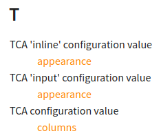

.. include:: /Includes.rst.txt
.. highlight:: rst

.. _Add-object-types:

=========================
Added object types
=========================

You can add your own `object types
<https://www.sphinx-doc.org/en/master/extdev/appapi.html#sphinx.application.Sphinx.add_object_type>`__
"on the fly". Define as many triples of ["directive", "textrole", "index
entry"] as you need. Each triple forms a namespace that groups elements
together.

.. contents:: This page
   :backlinks: top
   :class: compact-list
   :depth: 99
   :local:

A demo link to t3tsref
======================

1. Find out what link target "the other" manual offers and visit
   https://docs.typo3.org/m/typo3/reference-typoscript/main/en-us/objects.inv.json

2. Url `.../objects.inv.json` is available for all manuals we have that were rendered
   with the DRC (docker rendering container)

3. In this manual in :file:`Settings.cfg` we associate 't3tsref' with the TypoScript
   reference manual::

   .. code-block:: ini

       [intersphinx_mapping]

       t3tsref = https://docs.typo3.org/m/typo3/reference-typoscript/main/en-us/

4. Now we can link to a special target in another manual symbolically, that is without
   mentioning the absolute url. Let's link to `'https://docs.typo3.org/m/typo3/reference-typoscript/main/en-us/ContentObjects/Case/Index.html#cobj-case-stdWrap'
   <https://docs.typo3.org/m/typo3/reference-typoscript/main/en-us/ContentObjects/Case/Index.html#cobj-case-stdWrap>`__ can create a link to

   :ref:`stdWrap`

   :external:std:`stdWrap`

   :external:cobj-case:`stdWrap`

   :ref:`t3tsref:stdWrap`

   :ref:`t3tsref:cobj-case-stdWrap`

   :cobj-case:`stdWrap`

   :ref:cobj-case:`stdWrap`

   :t3tsref:cobj-case:`stdWrap`

   :ref:t3tsref:cobj-case:`stdWrap`

   `t3tsref:cobj-case-stdWrap`__

   `t3tsref:cobj-case:stdWrap`__

Sphinx API app.add_object_type()
================================

.. versionadded:: v3.0.dev13 of DRC (Docker Rendering Container)

See: https://www.sphinx-doc.org/en/master/extdev/appapi.html#sphinx.application.Sphinx.add_object_type

Authors can use that functionionality with appropriate lines in
:file:`Settings.cfg`. Each line adds define a triple ⓐ directive plus ⓑ
textrole ⓒ plus index entry that work together. They form a namespace to
describe properties (alias attributes) of an object.

The ⓐ directive is used to describe the property. In general that description
is typeset as a "definition", but may have a special styling if the theme
accounts for it.

The ⓑ textrole allows easy linking to the definition.

All definitions are ⓒ appear as grouped index entries in the main index.

Define and use object types
---------------------------

In file :file:`Settings.cfg` we add, for example:

.. code-block:: ini

   [sphinx_object_types_to_add]

   # DIRECTIVE_NAME =  DIRECTIVE_NAME // TEXTROLE_NAME // OBJECT_NAME
   # Each line is used for a call of the Sphinx API function 'app.add_object_type()'
   # and creates a Sphinx directive, a Sphinx textrole and a group of index entries.
   # See: https://www.sphinx-doc.org/en/master/extdev/appapi.html#sphinx.application.Sphinx.add_object_type
   cvtca       =  cvtca        //  cvtca        //  TCA configuration value
   cvtcainline =  cvtcainline  //  cvtcainline  //  TCA 'inline' configuration value
   cvtcainput  =  cvtcainput   //  cvtcainput   //  TCA 'input' configuration value

Now we can use the directive 'cvtca' ("TCA configuration value") to conveniently
give definitions of properties of this object type 'tca':

Example for 'cvtca'
~~~~~~~~~~~~~~~~~~~

Speak: configuration value TCA

Definition line: `cvtca =  cvtca // cvtca // TCA configuration value`

.. cvtca:: columns

   The `[‘columns’]` section contains configuration for each table field (also
   called “column”) which can be edited or shown in the backend. This is
   typically the biggest part of a TCA definition.

And by means of the textrole we can conveniently link to exactly this
definition, which by design, is unique: ``"Linking to :cvtca:`columns`"`` ->
"Linking to :cvtca:`columns`.

Example for 'cvtcainline'
~~~~~~~~~~~~~~~~~~~~~~~~~

Speak: configuration value TCA inline

Definition line: `cvtcainline =  cvtcainline // cvtcainline // TCA 'inline' configuration value`

.. cvtcainline:: appearance

   :When:   $GLOBALS[‘TCA’][$table][‘columns’][$field][‘config’]['type'] === 'inline'
   :Path:   $GLOBALS[‘TCA’][$table][‘columns’][$field][‘config’]
   :Type:   array
   :Scope:  Display

   Has information about the appearance of child-records, namely ...

And by means of the textrole we can conveniently link to exactly this
definition: ``"Linking to :cvtcainline:`appearance`"`` ->
"Linking to :cvtcainline:`appearance`".

Example for 'cvtcainput'
~~~~~~~~~~~~~~~~~~~~~~~~

Speak: configuration value TCA input

Definition line: `cvtcainput =  cvtcainput // cvtcainput // TCA 'input' configuration value`

.. cvtcainput:: appearance

   :When:   $GLOBALS[‘TCA’][$table][‘columns’][$field][‘config’]['type'] === 'input'
   :Path:   $GLOBALS[‘TCA’][$table][‘columns’][$field][‘config’]
   :Type:   array
   :Scope:  Display

   Has information about the appearance of child-records, namely ...

And by means of the textrole `:cvtcainput:` we can conveniently link to exactly
this definition: ``"Linking to :cvtcainput:`appearance`"`` ->
"Linking to :cvtcainput:`appearance`".

Automatically created index entries
~~~~~~~~~~~~~~~~~~~~~~~~~~~~~~~~~~~

And this will be the result on the index page:

