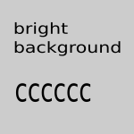

.. include:: /Includes.rst.txt

.. _images-float-and-alignment:

===================
Float and alignment
===================

.. contents:: This page
   :backlinks: top
   :class: compact-list
   :depth: 99
   :local:

.. _images-float-image-left:

Image float left
================

|example-teaser-left|
Typesetting is the composition of text by means of arranging physical
types[1] or the digital equivalents. Stored letters and other symbols
(called sorts in mechanical systems and glyphs in digital systems)
are retrieved and ordered according to a language's orthography for
visual display.

.. rst-class:: clear-both

Floating cleared. Below the image.

.. _images-float-image-right:

Image float right
=================

|example-teaser-right|
Typesetting is the composition of text by means of arranging physical
types[1] or the digital equivalents. Stored letters and other symbols
(called sorts in mechanical systems and glyphs in digital systems)
are retrieved and ordered according to a language's orthography for
visual display.

.. rst-class:: clear-both

Floating cleared. Below the image.

.. _images-float-figure-left:

Figure float left
=================

   A figure floated to the left

Typesetting is the composition of text by means of arranging physical
types[1] or the digital equivalents. Stored letters and other symbols
(called sorts in mechanical systems and glyphs in digital systems)
are retrieved and ordered according to a language's orthography for
visual display. Typesetting requires one or more fonts. The source
could be a manuscript, a previously composed version, or a plain text.

.. rst-class:: clear-both

Floating cleared. Below the figure.

.. _images-float-figure-right:

Figure float right
==================

   A figure floated to the right

Typesetting is the composition of text by means of arranging physical
types[1] or the digital equivalents. Stored letters and other symbols
(called sorts in mechanical systems and glyphs in digital systems)
are retrieved and ordered according to a language's orthography for
visual display. Typesetting requires one or more fonts. The source
could be a manuscript, a previously composed version, or a plain text.

.. rst-class:: clear-both

Floating cleared. Below the figure.

.. _images-float-align-left:

Figure align left
=================

   A figure aligned left via :align:

Typesetting is the composition of text by means of arranging physical
types[1] or the digital equivalents. Stored letters and other symbols
(called sorts in mechanical systems and glyphs in digital systems)
are retrieved and ordered according to a language's orthography for
visual display. Typesetting requires one or more fonts. The source
could be a manuscript, a previously composed version, or a plain text.

.. rst-class:: clear-both

Floating cleared. Below the figure.

.. _images-float-align-right:

Figure align right
==================

   A figure aligned right via :align:

Typesetting is the composition of text by means of arranging physical
types[1] or the digital equivalents. Stored letters and other symbols
(called sorts in mechanical systems and glyphs in digital systems)
are retrieved and ordered according to a language's orthography for
visual display. Typesetting requires one or more fonts. The source
could be a manuscript, a previously composed version, or a plain text.

.. rst-class:: clear-both

Floating cleared. Below the figure.
