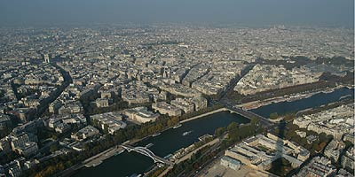
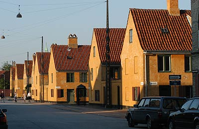
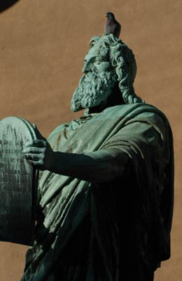
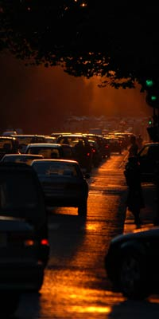
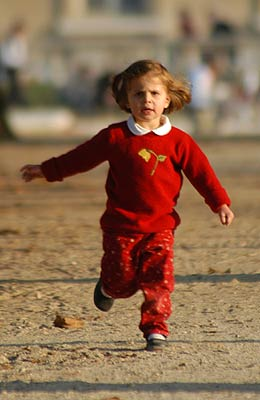
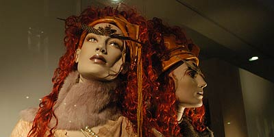
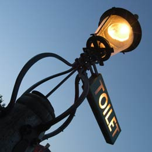
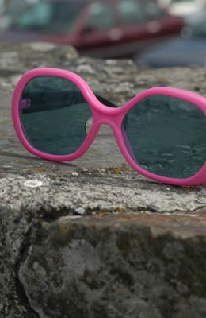

.. include:: /Includes.rst.txt

.. _Images-and-figures:

==================
Images and figures
==================

.. contents:: This page
   :backlinks: top
   :class: compact-list
   :depth: 99
   :local:

Bright images with border and shadow
====================================

.. image:: ../images/q150_ffffff.png
   :alt: Image with background color #ffffff
   :class: with-border with-shadow

.. image:: ../images/q150_f8f8f8.png
   :alt: Image with background color #f8f8f8
   :class: with-border with-shadow

.. image:: ../images/q150_eeeeee.png
   :alt: Image with background color #eeeeee
   :class: with-border with-shadow

.. image:: ../images/q150_dddddd.png
   :alt: Image with background color #dddddd
   :class: with-border with-shadow

.. image:: ../images/q150_cccccc.png
   :alt: Image with background color #cccccc
   :class: with-border with-shadow

.. image:: ../images/q150_ffffff.png
   :alt: Image with background color #ffffff
   :class: with-border with-shadow

.. image:: ../images/q150_f8f8f8.png
   :alt: Image with background color #f8f8f8
   :class: with-border with-shadow

.. image:: ../images/q150_eeeeee.png
   :alt: Image with background color #eeeeee
   :class: with-border with-shadow

.. image:: ../images/q150_dddddd.png
   :alt: Image with background color #dddddd
   :class: with-border with-shadow

.. image:: ../images/q150_cccccc.png
   :alt: Image with background color #cccccc
   :class: with-border with-shadow

Bright images with border
=========================

.. image:: ../images/q150_ffffff.png
   :alt: Image with background color #ffffff
   :class: with-border

.. image:: ../images/q150_f8f8f8.png
   :alt: Image with background color #f8f8f8
   :class: with-border

.. image:: ../images/q150_eeeeee.png
   :alt: Image with background color #eeeeee
   :class: with-border

.. image:: ../images/q150_dddddd.png
   :alt: Image with background color #dddddd
   :class: with-border

.. image:: ../images/q150_cccccc.png
   :alt: Image with background color #cccccc
   :class: with-border

Bright images with shadow
=========================

.. image:: ../images/q150_ffffff.png
   :alt: Image with background color #ffffff
   :class: with-shadow

.. image:: ../images/q150_f8f8f8.png
   :alt: Image with background color #f8f8f8
   :class: with-shadow

.. image:: ../images/q150_eeeeee.png
   :alt: Image with background color #eeeeee
   :class: with-shadow

.. image:: ../images/q150_dddddd.png
   :alt: Image with background color #dddddd
   :class: with-shadow

.. image:: ../images/q150_cccccc.png
   :alt: Image with background color #cccccc
   :class: with-shadow

Bright images as figures with caption
=====================================

.. figure:: ../images/q150_ffffff.png
   :alt: Image with background color #ffffff
   :class: with-border with-shadow

   Image with border and shadow and background color #ffffff

.. figure:: ../images/q150_f8f8f8.png
   :alt: Image with background color #f8f8f8
   :class: with-border with-shadow

   Image with border and shadow and background color #f8f8f8

.. figure:: ../images/q150_eeeeee.png
   :alt: Image with background color #eeeeee
   :class: with-border with-shadow

   Image with border and shadow and background color #eeeeee

.. figure:: ../images/q150_dddddd.png
   :alt: Image with background color #dddddd
   :class: with-border with-shadow

   Image with border and shadow and background color #dddddd

.. figure:: ../images/q150_cccccc.png
   :alt: Image with background color #cccccc
   :class: with-border with-shadow

   Image with border and shadow and background color #cccccc

Image float left
================

.. |example-teaser-left| image:: ../images/loremipsum/a4.jpg
   :alt: Left floating image
   :class: float-left with-shadow

|example-teaser-left|
Typesetting is the composition of text by means of arranging physical
types[1] or the digital equivalents. Stored letters and other symbols
(called sorts in mechanical systems and glyphs in digital systems)
are retrieved and ordered according to a language's orthography for
visual display.

.. rst-class:: clear-both

Floating cleared. Below the image.
Typesetting is the composition of text by means of arranging physical
types[1] or the digital equivalents. Stored letters and other symbols
(called sorts in mechanical systems and glyphs in digital systems)
are retrieved and ordered according to a language's orthography for
visual display.

.. |example-teaser-right| image:: ../images/loremipsum/a4.jpg
   :alt: Right floating image
   :class: float-right with-shadow

|example-teaser-right|
Typesetting is the composition of text by means of arranging physical
types[1] or the digital equivalents. Stored letters and other symbols
(called sorts in mechanical systems and glyphs in digital systems)
are retrieved and ordered according to a language's orthography for
visual display.

.. rst-class:: clear-both

Floating cleared. Below the image.
Typesetting is the composition of text by means of arranging physical
types[1] or the digital equivalents. Stored letters and other symbols
(called sorts in mechanical systems and glyphs in digital systems)
are retrieved and ordered according to a language's orthography for
visual display.

Images of Series A
==================

.. image:: ../images/loremipsum/a4.jpg
   :alt: Image a4

.. image:: ../images/loremipsum/a7.jpg
   :alt: Image a7

Images of Series A with border
==============================

.. image:: ../images/loremipsum/a4.jpg
   :alt: Image a4
   :class: with-border

.. image:: ../images/loremipsum/a7.jpg
   :alt: Image a7
   :class: with-border

Images of Series A with shadow
==============================

.. image:: ../images/loremipsum/a4.jpg
   :alt: Image a4
   :class: with-shadow

.. image:: ../images/loremipsum/a7.jpg
   :alt: Image a7
   :class: with-shadow

Images of Series B
==================

|b1| |b2| |b3| |b4| |b5| |b6| |b7|

.. |b3| image:: ../images/loremipsum/b3.jpg
   :alt: Image b3
.. |b4| image:: ../images/loremipsum/b4.jpg
   :alt: Image b4

Figures of Series C
===================

.. figure:: ../images/loremipsum/c1.jpg
   :alt: figure c1

   Here you see c1

   Here you see c2

   Here you see c3

   Here you see c4

   Here you see c5

.. figure:: ../images/loremipsum/c6.jpg
   :alt: figure c6

   Here you see c6

   Here you see c7

Figures of Series C with border
===============================

.. figure:: ../images/loremipsum/c1.jpg
   :alt: figure c1
   :class: with-border

   Here you see c1

   Here you see c2

   Here you see c3

   Here you see c4

   Here you see c5

.. figure:: ../images/loremipsum/c6.jpg
   :alt: figure c6
   :class: with-border

   Here you see c6

   Here you see c7

Figures of Series C with shadow
===============================

.. figure:: ../images/loremipsum/c1.jpg
   :alt: figure c1
   :class: with-shadow

   Here you see c1

   Here you see c2

   Here you see c3

   Here you see c4

   Here you see c5

.. figure:: ../images/loremipsum/c6.jpg
   :alt: figure c6
   :class: with-shadow

   Here you see c6

   Here you see c7

Figures of Series D
===================

.. figure:: ../images/loremipsum/d1.jpg
   :alt: figure d1

   Here you see d1. The caption may as well be very long.
   So, this is an example of a rather longy caption.
