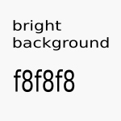
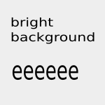

.. include:: /Includes.rst.txt

.. _Images-and-figures:

==================
Images and figures
==================

.. toctree::
   :titlesonly:

   Zoom
   FloatAndAlignment

Bright images with border and shadow
====================================

.. image:: ../images/q150_ffffff.png
   :alt: Image with background color #ffffff
   :class: with-border with-shadow

.. image:: ../images/q150_dddddd.png
   :alt: Image with background color #dddddd
   :class: with-border with-shadow

.. image:: ../images/q150_cccccc.png
   :alt: Image with background color #cccccc
   :class: with-border with-shadow

Bright images with border
=========================

.. image:: ../images/q150_ffffff.png
   :alt: Image with background color #ffffff
   :class: with-border

Bright images with shadow
=========================

.. image:: ../images/q150_ffffff.png
   :alt: Image with background color #ffffff
   :class: with-shadow

Bright images as figures with caption
=====================================

.. figure:: ../images/q150_ffffff.png
   :alt: Image with background color #ffffff
   :class: with-border with-shadow

   Image with border and shadow and background color #ffffff

   Image with border and shadow and background color #f8f8f8

Images and Admonitions
======================

..  versionadded:: 13.3
    EXT:form offers a site set that can be included as described here.

..  figure:: /images/q150_cccccc.png

    Add the site set "Form Framework"

..  note:: Include the site set "Form Framework" via the site set in the site
    configuration.
