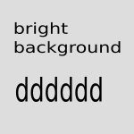
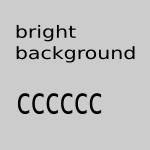

.. include:: /Includes.rst.txt

.. _Images-and-figures:

==================
Images and figures
==================

.. contents:: This page
   :backlinks: top
   :class: compact-list
   :depth: 99
   :local:

Zoom: Lightbox
==============

**Click to enlarge.** Opens the image in a modal dialog overlay. Click anywhere
or press Escape to close. The zoom indicator (magnifying glass icon) appears at
the bottom-right corner of the image.

.. list-table::
   :header-rows: 1
   :widths: 25 25 25 25

   * - Plain
     - Border
     - Shadow
     - Border + Shadow
   * - .. figure:: ../images/q150_f8f8f8.png
          :zoom: lightbox

          Figure
     - .. figure:: ../images/q150_eeeeee.png
          :zoom: lightbox
          :class: with-border

          Figure + border
     - .. figure:: ../images/q150_dddddd.png
          :zoom: lightbox
          :class: with-shadow

          Figure + shadow
     - .. figure:: ../images/q150_cccccc.png
          :zoom: lightbox
          :class: with-border with-shadow

          Figure + both
   * - .. image:: ../images/q150_f8f8f8.png
          :zoom: lightbox
          :alt: Image plain
     - .. image:: ../images/q150_eeeeee.png
          :zoom: lightbox
          :alt: Image with border
          :class: with-border
     - .. image:: ../images/q150_dddddd.png
          :zoom: lightbox
          :alt: Image with shadow
          :class: with-shadow
     - .. image:: ../images/q150_cccccc.png
          :zoom: lightbox
          :alt: Image with border and shadow
          :class: with-border with-shadow

Zoom: Gallery
=============

**Click to open gallery.** Opens in a gallery viewer with navigation between
images in the same gallery group. Use mouse wheel to zoom, drag to pan when
zoomed. Arrow keys or buttons navigate between images. Images are grouped by
the ``:gallery:`` option value.

Gallery Group A (screenshots):

.. list-table::
   :widths: 33 33 33

   * - .. figure:: ../images/q150_f8f8f8.png
          :zoom: gallery
          :gallery: screenshots
          :class: with-border with-shadow

          Screenshot 1
     - .. figure:: ../images/q150_eeeeee.png
          :zoom: gallery
          :gallery: screenshots
          :class: with-border with-shadow

          Screenshot 2
     - .. figure:: ../images/q150_dddddd.png
          :zoom: gallery
          :gallery: screenshots
          :class: with-border with-shadow

          Screenshot 3

Gallery Group B (photos):

.. list-table::
   :widths: 50 50

   * - .. image:: ../images/q150_cccccc.png
          :zoom: gallery
          :gallery: photos
          :alt: Photo 1
          :class: with-border with-shadow
     - .. image:: ../images/q150_ffffff.png
          :zoom: gallery
          :gallery: photos
          :alt: Photo 2
          :class: with-border with-shadow

Zoom: Lens
==========

**Hover to magnify.** A magnifying lens follows your cursor over the image,
showing a zoomed view. The lens only activates when hovering the actual image
content (not border/padding). A result panel shows the magnified area. Use
keyboard (Enter to toggle, arrows to move) for accessibility.

.. list-table::
   :header-rows: 1
   :widths: 25 25 25 25

   * - Plain
     - Border
     - Shadow
     - Border + Shadow
   * - .. figure:: ../images/q150_f8f8f8.png
          :zoom: lens

          Figure
     - .. figure:: ../images/q150_eeeeee.png
          :zoom: lens
          :class: with-border

          Figure + border
     - .. figure:: ../images/q150_dddddd.png
          :zoom: lens
          :class: with-shadow

          Figure + shadow
     - .. figure:: ../images/q150_cccccc.png
          :zoom: lens
          :class: with-border with-shadow

          Figure + both
   * - .. image:: ../images/q150_f8f8f8.png
          :zoom: lens
          :alt: Image plain
     - .. image:: ../images/q150_eeeeee.png
          :zoom: lens
          :alt: Image with border
          :class: with-border
     - .. image:: ../images/q150_dddddd.png
          :zoom: lens
          :alt: Image with shadow
          :class: with-shadow
     - .. image:: ../images/q150_cccccc.png
          :zoom: lens
          :alt: Image with border and shadow
          :class: with-border with-shadow

Zoom: Inline
============

**Scroll to zoom.** Use mouse wheel directly on the image to zoom in/out.
When zoomed, drag to pan. Double-click or press Escape to reset. The expand
icon indicates scroll zoom is available. Keyboard: +/- to zoom, arrows to pan.

.. list-table::
   :header-rows: 1
   :widths: 25 25 25 25

   * - Plain
     - Border
     - Shadow
     - Border + Shadow
   * - .. figure:: ../images/q150_f8f8f8.png
          :zoom: inline

          Figure
     - .. figure:: ../images/q150_eeeeee.png
          :zoom: inline
          :class: with-border

          Figure + border
     - .. figure:: ../images/q150_dddddd.png
          :zoom: inline
          :class: with-shadow

          Figure + shadow
     - .. figure:: ../images/q150_cccccc.png
          :zoom: inline
          :class: with-border with-shadow

          Figure + both
   * - .. image:: ../images/q150_f8f8f8.png
          :zoom: inline
          :alt: Image plain
     - .. image:: ../images/q150_eeeeee.png
          :zoom: inline
          :alt: Image with border
          :class: with-border
     - .. image:: ../images/q150_dddddd.png
          :zoom: inline
          :alt: Image with shadow
          :class: with-shadow
     - .. image:: ../images/q150_cccccc.png
          :zoom: inline
          :alt: Image with border and shadow
          :class: with-border with-shadow

Zoom Indicator Options
======================

The zoom indicator can be hidden using ``:zoom-indicator: false``:

.. list-table::
   :widths: 50 50

   * - With indicator (default)
     - Without indicator
   * - .. figure:: ../images/q150_f8f8f8.png
          :zoom: lightbox
          :class: with-border with-shadow

          Indicator visible
     - .. figure:: ../images/q150_eeeeee.png
          :zoom: lightbox
          :zoom-indicator: false
          :class: with-border with-shadow

          Indicator hidden

Bright images with border and shadow
====================================

.. image:: ../images/q150_ffffff.png
   :alt: Image with background color #ffffff
   :class: with-border with-shadow

.. image:: ../images/q150_eeeeee.png
   :alt: Image with background color #eeeeee
   :class: with-border with-shadow

Bright images with border
=========================

.. image:: ../images/q150_ffffff.png
   :alt: Image with background color #ffffff
   :class: with-border

.. image:: ../images/q150_eeeeee.png
   :alt: Image with background color #eeeeee
   :class: with-border

Bright images with shadow
=========================

.. image:: ../images/q150_ffffff.png
   :alt: Image with background color #ffffff
   :class: with-shadow

.. image:: ../images/q150_eeeeee.png
   :alt: Image with background color #eeeeee
   :class: with-shadow

Bright images as figures with caption
=====================================

.. figure:: ../images/q150_ffffff.png
   :alt: Image with background color #ffffff
   :class: with-border with-shadow

   Image with border and shadow and background color #ffffff

   Image with border and shadow and background color #f8f8f8

Image float left
================

|example-teaser-left|
Typesetting is the composition of text by means of arranging physical
types[1] or the digital equivalents. Stored letters and other symbols
(called sorts in mechanical systems and glyphs in digital systems)
are retrieved and ordered according to a language's orthography for
visual display.

.. rst-class:: clear-both

Floating cleared. Below the image.

Images and Admonitions
======================

..  versionadded:: 13.3
    EXT:form offers a site set that can be included as described here.

..  figure:: /images/q150_cccccc.png

    Add the site set "Form Framework"

..  note:: Include the site set "Form Framework" via the site set in the site
    configuration.
